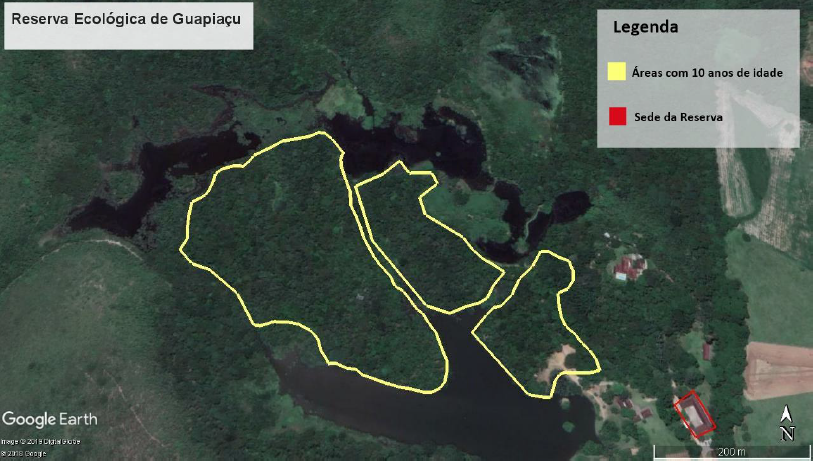
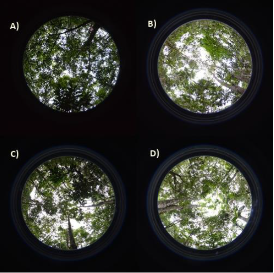
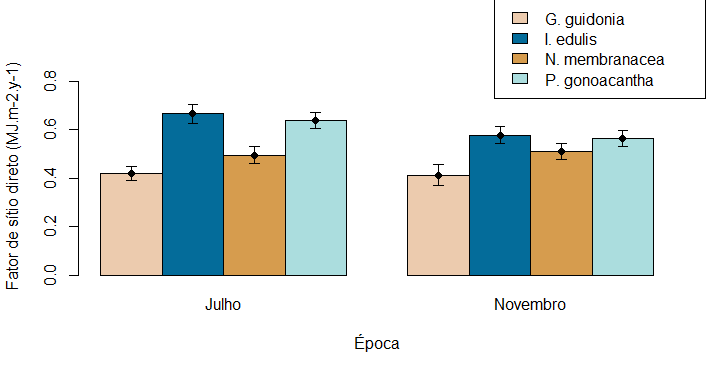
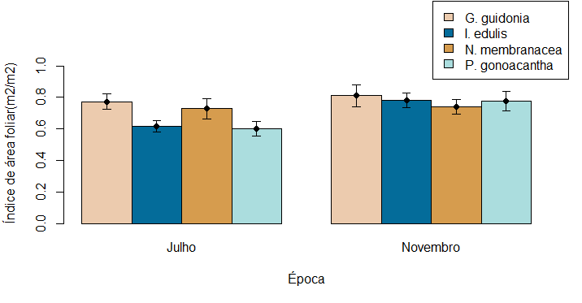

```{r setup, include=FALSE}
knitr::opts_chunk$set(echo = TRUE)
```

## Introdução

As plantas estão entre os engenheiros ecológicos mais importantes, pois podem criar, manter ou modificar os habitats, influenciando assim o ambiente físico e a biota local (JONES et al., 1997 apud. SOUZA et al., 2014, p.1). A partir do momento em que elas podem criar, manter ou modificar os habitats, elas podem atuar como facilitadoras, criando relações positivas entre as espécies onde pelo menos uma se beneficia sem que a outra sofra danos (Hunter e Aarssen 1988, Goldberg 1990, Callaway 1994). Ao perceber os efeitos diferenciados que espécies podem ocasionar abaixo de suas copas ao modificarem o clima e permitirem algum tipo de facilitação, diversos autores adotaram o conceito de "filtros ecológicos" para espécies vegetais (George e Bazzaz 1999; Peters et al. 2004; Gandolfi et al. 2007; Souza 2007; Abreu et al. 2013). Entender a ecologia dessas plantas é de extrema importância por elas influenciarem diretamente nas condições do ambiente no qual estão inseridas.

Gandolfi et al.(2007) propõe que cada espécie de floresta tropical e subtropical pode criar condições específicas de microclima abaixo de sua copa. Cada espécie arbórea que ocupa o dossel de uma floresta, devido ao seu porte e a sua longa permanência num determinado local, pode exercer grande influência, por exemplo, no padrão de luz no sub-bosque (Gandolfi, 2000) e consequentemente, influenciando no recrutamento das plântulas.

Tucker e Murphy (1997) abordam o uso do método “FrameWork Species” na restauração. De acordo com Elliott et al.(2002), espécies "framework" poderiam ser descritas como "espécies-chave" que apresentam um crescimento relativamente rápido com copas densas e, que quando plantadas em áreas degradadas, rapidamente sombreiam. Elas também fornecem recursos para a vida selvagem (frutas, néctar, etc) em uma idade precoce, e os animais atraídos por esses recursos, dispersam as sementes de outras espécies de árvores não plantadas, acelerando assim o retorno da biodiversidade.

Desta forma, compreender os mecanismos e efeitos da transmissão de luz e sua incidência no sub-bosque tem efeitos no campo ecológico e na restauração, e ao unirmos os conhecimentos da ecologia funcional com manejo florestal e restauração considerando o efeito de filtros ecológicos das espécies arbóreas, seria possível propor “espécies chave”, as quais proporcionassem o aumento da biodiversidade e maximizassem a restauração dos processos ecossistêmicos.

## Objetivo

### Geral
O estudo tem como objetivo quantificar a heterogeneidade do ambiente luminoso sob a copa das quatro espécies arbóreas nativas da Floresta Atlântica - Piptadenia gonoacantha (Martius, 1919), Inga edulis Mart., Guarea guidonia (L.) e Nectandra membranacea (Swartz) Griseb.

### Específico
Avaliar uma variável específica do ambiente luminoso sob a copa de quatro espécies arbóreas e em dois períodos diferentes, julho e novembro de 2017, sendo essa variável o Fator de Sítio Direto(FSD). Além disso, será analisado o Índice de Área Foliar (IAF) dessas espécies. O objetivo é comparar a similaridade ou diferença entre as espécies e também observar se houve diferença para cada espécie individualmente nos dois períodos.

## Hipótese

O ambiente luminoso no sub-bosque abaixo das copas será diferente entre as espécies analisadas.
           
O sub-bosque abaixo da copa de Inga edulis e Piptadenia gonoacantha apresentará maiores valores de FSD e IAF. Isso porque ambas são espécies caducifólias. A área abaixo da copa de Guarea guidonia e Nectandra membranacea apresentará menores valores de FSD e IAF. Isso por ambas serem espécies perenifólias.

## Material e Métodos

### Área de Estudo

O trabalho foi realizado na Reserva Ecológica do Guapiaçu – REGUA, localizada na comunidade rural de Guapiaçu, 3° distrito do município de Cachoeiras de Macacu, Estado do Rio de Janeiro. Possuindo 7380 hectares de extensão territorial compreendidos na bacia do rio Guapiaçu, a REGUA está inserida no bioma da Mata Atlântica e contém a maior parte de sua área, 94,78%, composta por grandes remanescentes florestais em bom estado de conservação, o que lhe confere uma grande diversidade de fauna e flora (BERNARDO, 2010 apud. AZEVEDO, 2012, p.6).

A propriedade está em posse da família Locke desde 1908, onde eram desenvolvidas as atividades agrícolas e a pecuária extensiva na chamada “Fazenda São José de Guapiaçu”. Por volta de 1915 e 1920 as partes baixas (com algum relevo ondulado) desta fazenda tiveram suas áreas, compostas por cobertura vegetal original nos ecossistemas florestal e lêntico, convertidas em pastagem (informação verbal do proprietário Nicholas Locke). Somente no ano de 2004, as práticas agropecuárias foram interrompidas e toda a área passou a fazer parte da ONG. Neste mesmo ano a primeira área foi reflorestada, a fim de reconectar fragmentos isolados com a criação de corredores ecológicos e, desde então, a Reserva vem recuperando áreas degradadas de encostas e de baixadas, bem como reabilitando e restaurando áreas originais de ecossistemas lênticos. O trabalho foi realizado em uma área de reflorestamento da REGUA que possui 9,6 há. A área possui um reflorestamento com 10 anos de idade. A formação florestal foi caracterizada como floresta ombrófila densa das terras baixas. Apresenta o solo caracterizado como latossolo amarelo (AZEVEDO, 2012, p.22).



### Espécies focais selecionadas

As espécies focais foram selecionadas principalmente em função da caducifolia e da estrutura de copa, sendo elas espécies arbóreas nativas da Floresta Atlântica – Piptadenia gonoacantha (Martius, 1919), Inga edulis Mart., Guarea guidonia (L.) e Nectandra membranacea (Swartz) Griseb. Foram selecionadas 10 árvores de cada espécie, com altura maior que 7 metros e diâmetro a altura do peito (DAP) superior a 10 centímetro e que estivessem bem distribuídas pela área do projeto de restauração implantado há dez anos na Reserva Ecológica de Guapiaçu, município de Cachoeiras de Macacu – Rio de Janeiro.

### Fotos Hemisféricas
Para mensuração da heterogeneidade luminosa, foram realizadas fotos hemisféricas em dois períodos do ano de 2017 (julho e novembro) sob a copa de todos os indivíduos das espécies focais. As fotos foram retiradas em horários em que não houvesse luz direta, ou seja, no início da manhã e no fim da tarde, ou em dias em que estivesse nublado, através de uma câmera digital Nikon D3200 4.5mm e lente fish-eye. O tripé foi posicionado em uma altura de 1,5m do solo. As imagens foram analisadas através do software hemiview versão 2.1.



### Variáveis Analisadas

A densidade das folhas na vegetação pode ser expressa quantitativamente por meio do índice de área foliar (IAF). Alguns pesquisadores adotaram a definição de IAF como metade da área foliar total por unidade de área de superfície do solo (Lang et al. 1991; Chen e Black, 1992), ao contrário da área projetada, que não funciona bem para todas as formas de folhas. O índice de área foliar (IAF) é amplamente utilizado para descrever a superfície fotossintética e transpiracional de copas de plantas e tem amplas aplicações em modelagem de balanço hídrico e caracterização de interações entre atmosfera e vegetação. (Rich et al. 1998)

Nas análises das fotos, selecionamos como variável o fator de sítio direto. Fatores de sítio são índices da proporção de radiação que atinge um determinado local. Os valores variam de 0 a 1, com 0 sem radiação (obstrução completa do céu) e 1 sendo a radiação para um local aberto (visibilidade completa do céu = sem obstrução do céu). De acordo com Rich (1990) o fator de sítio direto (FSD) é a proporção de radiação solar direta que atinge um determinado local, em relação a um local sem obstruções no céu, ou seja, acima do dossel. Fatores de sítio podem ser facilmente estimados a partir de fotografias de dossel, dadas as suposições sobre a contribuição da radiação difusa e direta de cada setor do céu.

### Análise dos dados 

A análise estatística foi analisa através do software R versão 1.2.5033. rimeiramente foi feito um teste de Levenne para avaliar a homogeinidade dos dados. Já a normalidade, foi avalisada através de um teste de Shapiro-Wilk. Ambos os testes deram p<0.05. Após as análises, os dados foram transformados utilizando Log. Uma ANOVA bigatorial foi utilizada usando as espécies, FSD e IAF. Ao final, foi feito um pós-teste de Tukey para avaliar as diferenças entre os tratamentos. 


## Resultados 

O ambiente luminoso no sub-bosque abaixo das copas foi diferente entre as espécies.O FSD e o IAF tiveram p<0.05. A hipótese de que a variável fator de sítio direto (FSD) e índice de área foliar (IAF) seriam maiores para Inga edulis e Piptadenia gonoacantha e menores para Guarea guidonia e Nectandra membranacea foi confirmada (ver figura 3 e 4).






Comparando as espécies separadamente para analisar a ocorrência de variação entre o mês de julho e novembro, I. edulis apresentou diferença significativa em seu IAF.

## Discussão

As diferenças observadas no padrão de luz sob a copa das diferentes espécies arbóreas corroboram a hipótese dos filtros ecológicos, testada pelo estudo. Uma provável causa da heterogeneidade leve do sub-bosque, dentro e entre as comunidades, é a composição de espécies de dossel. Lee (1989) afirma que mudanças no grau de cobertura do dossel determinaram em grande parte a quantidade de luz disponível no sub-bosque florestal.

Nesse estudo podemos perceber que mesmo o reflorestamento sendo jovem e apresentando apenas 10 anos de idade, existe uma diferença significativa abaixo das copas das diferentes espécies arbóreas estudadas, o que contribui para diferentes microhabitats com padrões de luz diversificados.

## Referências

Abreu R. C. R; Santos F. F. M & Durigan G. 2013. Changes in plant community of Seasonally Semideciduous Forest after invasion of Schizolobium parahyba at southeastern Brazil. Acta Oecologia. 54: 57-64.

Azevedo, A. D. Composição florística e estoque de carbono em áreas de recuperação da mata atlântica na bacia do rio guapiaçu, Cachoeiras de Macacu, RJ. Dissertação. Universidade Federal Rural do Rio de Janeiro, Seropédica, Rio de Janeiro. 162 p, 2012.

Callaway, R. M. 1994. Facilitative and interfering effects of Anthrocnemum subterminale on winter annuals. Ecology 75:681–686.

Chen, J.M., and T.A. Black. 1992. Defining leaf area index for non-flat leaves. Plant, Cell and Environment 15:421-429.

Galdolfi, S.; Joly, C. A.; Rodrigues, R. R. Permeability- impermeability: canopy trees as biodiversity filters. Scientific Agriculture 64(4): 433-438, 2007.

Gandolfi, S. 2000. História natural de uma floresta estacional semidecidual no município de Campinas (São Paulo, Brasil). Tese de Doutorado, Universidade Estadual de Campinas, São Paulo.

George, L. O. & Bazzaz, F. A. 1999. The furn understory as an ecological filter: emergenge and stablishment of canopy-tree seedlings. Ecology. 80: 833-845

Goldberg, D. E. 1990. Components of resource competition in plant communities. Pages 27–49 in J. B. Grace and D. Tilman, editors. Perspectives on plant competition. Academic Press, New York, New York, USA.

Lang, A.R.G., R.E. McMurtrie, and M.L. Benson. 1991. Validity of surface área indices of Pinus radiata estimated from transmittance of the sun’s beam. Agricultural and Forest Meteorology. 37:229-243.

Lee, D.W. 1989. Canopy dynamics and light climates in a tropical moist deciduous forest in India. Journal of Tropical Ecology. 5:65-79.

Peters H. A.; Pauw A.; Silman M. R. & Terborgh J. W. 2004. Falling palm fronds structure Amazonian rainforest sapling communities. Proceedings of the Royal Society of London B. (Suppl.) 271: 369-369

Rich, P.M., 1990. Characterizing plant canopies with hemispherical photo- graphs. Remote Sens. Rev. 5, 13–29.

Rich, P.M., Wood, J., Vieglais, D.A., Burek, K., Webb, N. 1998. HemiView Manual Revision Number: 2.1

Souza, F. M. 2007. Associações entre as espécies arbóreas do dossel e do subosque em uma Floresta Estacional Semidecidual. Tese de Doutorado – Universidade Estadual de Campinas 97p.

Souza, F. M., Gangolfi, S.; Rodrigues, R. R. 2014. Deciduousness Influences the Understory Community in a Semideciduous Tropical Forest. Biotropica. 46:512-515.
